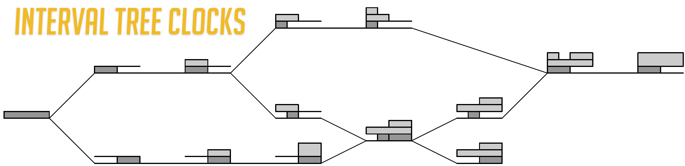

# Interval Tree Clocks in Go

In distributed systems, a central problem is managing causality in
operations applied at different sites to the same data so that,
eventually, a single version of the data can be agreed upon by all
participants. 

The problem of keeping track of logical time was explored by 
[Lamport](#references) in his development of Vector Clocks. Subsequently, Version
Vectors were developed to handle a similar problem in state replication.

Both Vector Clocks and Version Vectors _stamp_ a version of the shared
state with either a vector of local clock values - usually integers
starting at 0 and incrementing by 1 - or an array of tuples (_sid_,
_time_) where the _sid_ is a unique identifier for the processor and
_time_ is the same as the above mentioned integer counter.

In systems where the number of participants is unknown and potentially
large, maintaining the _stamps_ for all transactions can grow very large
and even exceed the size of the data itself. 

To address this problem, [Almeida et al](#references) developed Interval
Tree Clocks (ITCs). Interval Tree Clocks are similar to Version Vectors
except that they do not require one entry per _sid_. Instead, both the
identifiers and the clock values can grow and shrink in size
dynamically. 

Operations on ITCs are characterized by a **fork-event-join** model.
When a site (possibly a new site) wishes to begin work on the data, it
**forks** the data structure. Thereafter, it begins to execute one or
more **events**. Upon receipt of events from other participants, the
side **joins** those **events**. The **join** may result in the removal
of the current **Id**. If the site wishes to continue submitting
**events**, it again issues a **fork**. This process of
**fork-event(s)-join** continues.

This library provides a reference implementation of Interval Tree Clocks
for the [Go](#references) programming language.

# Protobuf

Since this library is intended to be used in a *distributed* system, it
required a binary encoding for on-the-wire transfer. Protobufs seemed an
excellent choice for this. To the extent the on-the-wire protocol is
compatible with the in-memory objects, I decided not to translate and
just to use the protobufs directly.

# References

* [1]: Lamport, Leslie. ["Time, Clocks, and the Ordering of Events in a Distributed
        System"](https://lamport.azurewebsites.net/pubs/time-clocks.pdf)
* [2]: Almeida, Paulo Sergio, Baquero, Carlos, and Fonte Victor ["Interval Tree Clocks: A Logical Clock for Dynamic Systems"](http://gsd.di.uminho.pt/members/cbm/ps/itc2008.pdf)
* [3]: The Go Authors. [The Go Programming Language](https://golang.org)